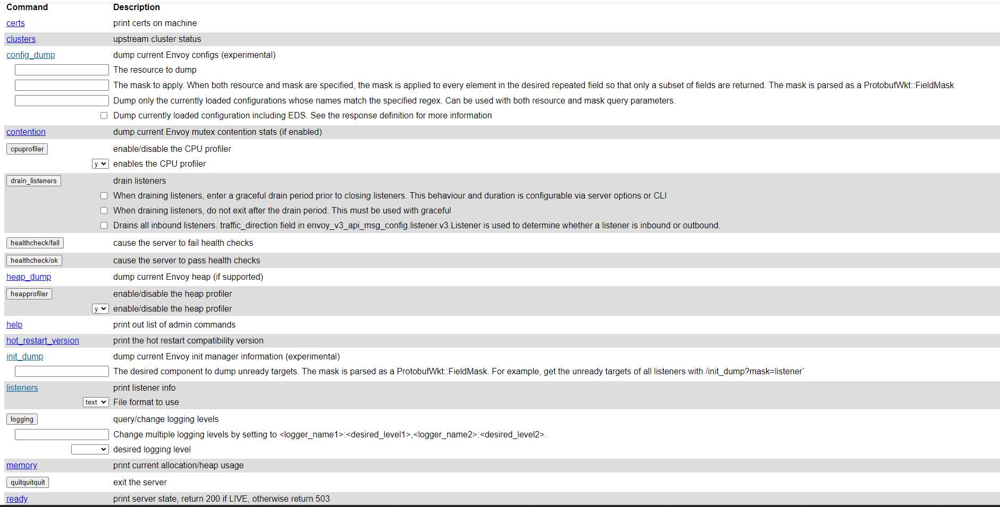

# Jalapeño API Gateway - Changes 

This README was created to display all the changes made in the JAGW project 

## Envoy-proxy 

### Health endpoint
The health endpoint on proxy-deploy template was added. 
I exposes the admin service and by accessing the admin web UI of envoy-proxy: 

```bash
http://loadbalancerIp:appServerPort
```
You can find a list of command and their description,and also the health endpoint to use (You can find it in the proxy-deploy, a readiness and liveliness were added): 



### Image 

The image was changed to a new one. By changing the tag og the image, i found that i had some issues with the listeners. It was link to the updated image, i had to add some filters. You can see the modification in proxy-cm. 
(You can see this github issue for more information: https://github.com/grpc/grpc-web/issues/1220)


## Redis 

For redis helm chart, i changed nothing.
But the image could be replaced to a new vesion : 7.2.3-debian-11-r3 


Nothing else were change, because the images of other services came from the jalapeno-api-gateway repository (So no health endpoint were added and i couldn't upadate the images)


